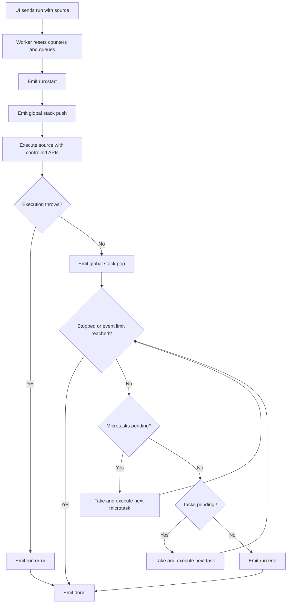
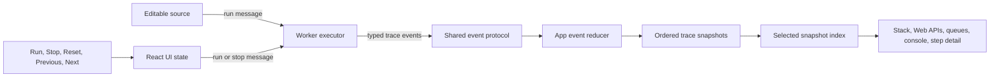

# Loupe X

Loupe X is a browser-based event loop visualiser for stepping through a small, instrumented subset of JavaScript behaviour. It shows recorded changes to the call stack, Web APIs, task queue, microtask queue, and console. It is a teaching tool, not a complete JavaScript engine or a secure execution sandbox.

## Features

- Edit a JavaScript script in the browser and run it in a Web Worker.
- Trace the global stack frame, controlled `setTimeout`, `queueMicrotask`, the supported `Promise.resolve(...).then(...)` pattern, and `console.log`.
- Record each trace event as a snapshot and step backwards or forwards with Previous and Next.
- See event type, a short description, console output, and runtime errors.
- Stop a run, reset the displayed trace, and report runs that exceed the event limit.
- Keep user code off the UI thread.

## Requirements and commands

Install a current Node.js release compatible with the Vite version in `package.json`, then install dependencies and start the development server:

```sh
npm install
npm run dev
```

Other project commands:

```sh
npm run build    # TypeScript project checks and production build
npm run lint     # ESLint
npm run preview  # Serve the production build locally
```

The production output is generated in `dist/`; it is build output, not source.

## Architecture

```text
src/
  App.tsx              UI, Worker lifecycle, trace reduction, snapshots, controls
  main.tsx             React application entry point
  index.css            Tailwind CSS entry
  protocol/events.ts   Typed worker messages, trace events, and snapshot shape
  worker/executor.ts   Controlled APIs, user-script execution, and event loop model
```

Vite serves and bundles the React + TypeScript client. `main.tsx` mounts `App`. The app creates a module Worker from `worker/executor.ts` and sends it a typed `run` message containing the current source. The worker emits typed trace events using the shared protocol. `App` reduces those events into snapshots held in React state; the selected snapshot drives the queue panels. The UI does not execute the submitted script itself.

The worker is the current execution adapter. There is no server adapter, parser/instrumenter, external JavaScript runtime, or shared event-replay engine yet.

## Event-loop algorithm

The worker supplies replacements for `console`, `setTimeout`, `queueMicrotask`, and a deliberately small `Promise.resolve(...).then(...)` implementation as parameters to a dynamically created function. Timer delay is recorded for display but does not determine real elapsed time. Timer callbacks are queued as tasks. Microtasks and tasks are drained synchronously by the worker in FIFO order; pending microtasks are drained before each task.



### Trace and stepping

Each worker event is added to the snapshot list. `applyEvent` copies the previous snapshot's arrays, then applies one change: push/pop a stack frame, add/remove a queue item, or append console output. This keeps earlier snapshots available for Previous without replaying the trace. Next and Previous only change the selected snapshot index; they do not re-execute the script. A fresh Run clears the prior snapshots and starts a new worker run.



## Trace protocol

`protocol/events.ts` defines the contract shared by UI and worker:

- `WorkerMessage`: `run` with source or `stop`.
- `WorkerEvent`: a trace `event` or terminal `done` notification.
- `TraceEvent`: run lifecycle, stack, timer, task, microtask, console, error, and event-limit events.
- `TraceSnapshot`: the selected event and arrays representing each visible panel.

When adding behavior, update the event union, worker producer, UI reducer/description, and any relevant documentation together. Keep worker execution and UI state separate.

## Current limits

The trace is intentionally approximate. It models only the APIs passed into the generated function. It does not instrument ordinary function calls, nested stack frames, browser-native Promise scheduling, intervals, cancellation, rendering, network activity, or the full host event loop. The Promise replacement is not a native Promise implementation. Timer delays do not wait in real time, and the worker drains its own queues synchronously.

## Security and execution boundary

- User code runs in a Worker, so ordinary script execution does not block the page's main thread.
- The UI communicates with the worker through the typed message protocol and terminates its worker during React effect cleanup.
- The worker passes controlled versions of four APIs to the script and limits emitted trace events to 10,000 per run.
- **This is not a security sandbox.** `new Function` code can still access globals available in its Worker environment; this implementation does not remove or reliably restrict network, storage, nested Worker, or other Worker APIs.
- The event limit counts emitted trace events, not instructions or elapsed time. A synchronous infinite loop may emit no events and block the worker. The Stop button sends a message, which cannot be handled while synchronous code occupies that worker. There is no watchdog or forced termination for an active run in the current implementation.
- Terminating a worker is abrupt and does not guarantee `finally` cleanup.

Do not use this app to run untrusted code as a security boundary. A real isolation design needs a main-thread watchdog that can terminate the worker, plus an explicit restricted execution environment and tests proving those restrictions.

## Contributing

1. Read `CONTEXT.md` and `.github/copilot-instructions.md` before changing execution or safety behaviour.
2. Keep trace messages serialisable and typed in `protocol/events.ts`.
3. Keep script execution inside the Worker. Do not move execution to the main thread.
4. Make trace ordering deterministic where possible; document any deliberate approximation.
5. Run `npm run build` and `npm run lint` before submitting changes. Add focused behavior tests when the project gains a test harness.
6. Do not copy upstream source or assets until their licence status is verified; reimplement behavior from documented concepts.

## TODO

- [ ] Add a main-thread watchdog that terminates long-running workers; test a synchronous infinite loop.
- [ ] Enforce the intended Worker API restrictions, or clearly isolate execution in a suitable sandbox.
- [ ] Add focused tests for event ordering, errors, event limits, and snapshot stepping.
- [ ] Instrument function entry/exit and source locations so call-stack and step details go beyond the global frame.
- [ ] Improve JavaScript semantics, including native-like Promise/microtask behavior and timer cancellation.
- [ ] Add TypeScript parsing and type erasure, then ES module support, as separate scope increments.
- [ ] Add autoplay and an event-loop view only after the trace model can support them accurately.